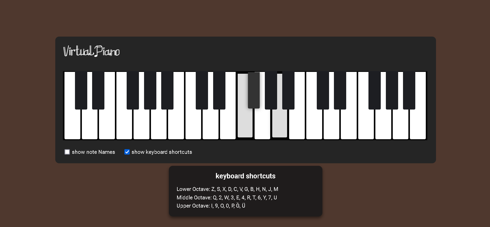

# Virtual Piano 🎹

An interactive virtual piano project designed for educational and entertainment purposes.

# How to Play
Click or Drag: Use your mouse to click on the piano keys or drag across them to play different notes.

Keyboard Shortcuts: Use the designated keyboard shortcuts for different octaves:
       
        Lower Octave: Z, S, X, D, C, V, G, B, H, N, J, M
        Middle Octave: Q, 2, W, 3, E, 4, R, T, 6, Y, 7, U
        Upper Octave: I, 9, O, 0, P, L, K

## Screenshots

